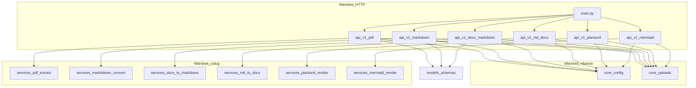
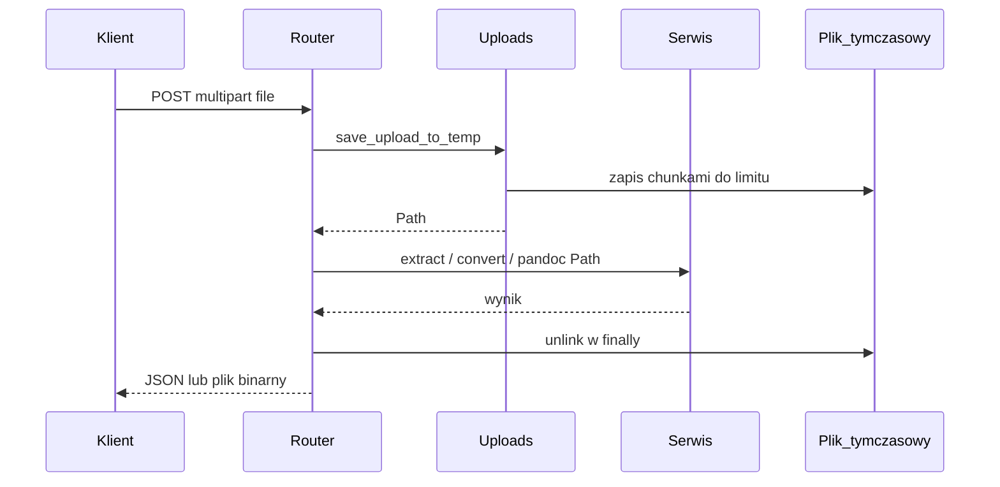

# Architektura utils-service

## Cel systemu

**utils-service** to lekka aplikacja HTTP (REST) udostępniająca zestaw małych, niezależnych usług pomocniczych. Obecnie:

1. **PDF → tekst** — ekstrakcja tekstu z pliku PDF.
2. **Plik → Markdown** — konwersja obsługiwanych formatów do Markdown za pomocą biblioteki Microsoft **markitdown**.
3. **DOCX → Markdown** — konwersja `.docx` do Markdown przez **Pandoc** z opcjonalnymi komentarzami / track changes i ekstrakcją obrazów.
4. **Markdown → DOCX** — konwersja `.md` / `.markdown` / `.txt` do dokumentu Word przez **Pandoc** (binarka w `PATH` lub w obrazie Docker).
5. **PlantUML → obraz** — renderowanie diagramu do **SVG** lub **PNG** przez CLI **PlantUML** (JRE + zwykle **Graphviz**).
6. **Mermaid → obraz** — renderowanie do **SVG** lub **PNG** przez **Mermaid CLI** (`mmdc`, Node + Puppeteer / Chrome).

Usługa jest **bezstanowa**: nie przechowuje trwale uploadów; przetwarzanie odbywa się na plikach tymczasowych usuwanych po żądaniu.

## Stos technologiczny

| Warstwa | Technologia |
|---------|-------------|
| HTTP / API | [FastAPI](https://fastapi.tiangolo.com/) |
| Serwer ASGI | [Uvicorn](https://www.uvicorn.org/) |
| Konfiguracja | [pydantic-settings](https://docs.pydantic.dev/latest/concepts/pydantic_settings/) (prefiks `UTILS_`) |
| PDF (tekst natywny) | [PyMuPDF](https://pymupdf.readthedocs.io/) (`fitz`) |
| PDF (OCR) | [Tesseract](https://github.com/tesseract-ocr/tesseract) przez [pytesseract](https://github.com/madmaze/pytesseract); render stron do obrazu przez PyMuPDF + [Pillow](https://python-pillow.org/) |
| Konwersja do Markdown | [markitdown](https://github.com/microsoft/markitdown) |
| DOCX → Markdown | [Pandoc](https://pandoc.org/) (CLI, JSON AST + post-processing track changes) |
| Markdown → DOCX | [Pandoc](https://pandoc.org/) (CLI, `subprocess`) |
| PlantUML → obraz | [PlantUML](https://plantuml.com/) (CLI, `subprocess`; Graphviz dla wielu typów diagramów) |
| Mermaid → obraz | [Mermaid CLI](https://github.com/mermaid-js/mermaid-cli) (`mmdc`, `subprocess`; Puppeteer / Chrome) |

## Widok logiczny (moduły)

## Struktura katalogów `app/`

| Ścieżka | Rola |
|---------|------|
| `app/main.py` | Tworzenie aplikacji FastAPI, rejestracja routerów pod `/v1`, endpoint `GET /health`. |
| `app/api/v1/pdf.py` | `POST /v1/pdf-to-text` — upload PDF, parametr zapytania `ocr`. |
| `app/api/v1/markdown.py` | `POST /v1/to-markdown` — upload pliku do konwersji (markitdown). |
| `app/api/v1/docx_markdown.py` | `POST /v1/docx-to-markdown` — upload `.docx`, query `comments`, `extract_media`. |
| `app/api/v1/md_docx.py` | `POST /v1/markdown-to-docx` — upload `.md` / `.markdown` / `.txt`, odpowiedź binarna DOCX. |
| `app/api/v1/plantuml.py` | `POST /v1/plantuml-to-image` — upload źródła PlantUML, query `format`, odpowiedź SVG lub PNG. |
| `app/api/v1/mermaid.py` | `POST /v1/mermaid-to-image` — upload źródła Mermaid, query `format`, odpowiedź SVG lub PNG. |
| `app/core/config.py` | `Settings`: limity, katalog temp, język i DPI OCR, próg trybu `auto`, timeouty, ścieżka Puppeteer (`UTILS_PUPPETEER_EXECUTABLE_PATH`). |
| `app/core/uploads.py` | Zapis strumienia uploadu do pliku tymczasowego z limitem rozmiaru. |
| `app/services/pdf_extract.py` | Ekstrakcja tekstu (natywnie / OCR / auto). |
| `app/services/markitdown_convert.py` | Wywołanie `MarkItDown` na ścieżce pliku. |
| `app/services/docx_to_markdown.py` | Pandoc DOCX → JSON → post-processing track changes → GFM; opcjonalnie ZIP `media/`. |
| `app/services/track_changes_postprocess.py` | Normalizacja AST Pandoc (wstawienia, usunięcia, komentarze). |
| `app/services/md_to_docx.py` | Wywołanie `pandoc` (wejście Markdown, wyjście DOCX w pamięci). |
| `app/services/plantuml_render.py` | Wywołanie `plantuml` (wejście `.puml`, wyjście SVG/PNG w pamięci). |
| `app/services/mermaid_render.py` | Wywołanie `mmdc` (Mermaid CLI; Puppeteer / Chrome wg `Settings`). |
| `app/models/schemas.py` | Modele odpowiedzi JSON (`PdfToTextResponse`, `ToMarkdownResponse`, `DocxToMarkdownResponse`). |

## Przepływ żądania (upload → odpowiedź)

## Endpointy (kontrakt wysokiego poziomu)

| Metoda i ścieżka | Wejście | Wyjście |
|------------------|---------|---------|
| `GET /health` | — | `{"status":"ok"}` |
| `POST /v1/pdf-to-text` | `multipart/form-data`: pole `file`; query `ocr`: `off` / `on` / `auto` | JSON: `text`, `page_count`, `used_ocr` |
| `POST /v1/to-markdown` | `multipart/form-data`: pole `file` | JSON: `markdown`, `title` (opcjonalnie) |
| `POST /v1/docx-to-markdown` | `multipart/form-data`: pole `file` (`.docx`); query `comments`, `extract_media` | JSON: `markdown`, `title`, `media_count`, `media_zip_base64` |
| `POST /v1/markdown-to-docx` | `multipart/form-data`: pole `file` (`.md`, `.markdown`, `.txt` lub odpowiedni `Content-Type`) | `200`: treść DOCX (`application/vnd.openxmlformats-officedocument.wordprocessingml.document`), nagłówek `Content-Disposition: attachment` |
| `POST /v1/plantuml-to-image` | `multipart/form-data`: pole `file`; query `format`: `svg` / `png` | `200`: treść `image/svg+xml` lub `image/png` |
| `POST /v1/mermaid-to-image` | `multipart/form-data`: pole `file`; query `format`: `svg` / `png` | `200`: treść `image/svg+xml` lub `image/png` |

Kody błędów typowe: `413` (przekroczony rozmiar), `415` (nie-PDF przy PDF, nie-DOCX przy docx-to-markdown lub niewłaściwy typ przy MD→DOCX / PlantUML / Mermaid), `422` (błąd konwersji markitdown lub błąd diagramu PlantUML / Mermaid), `503` (np. wymuszone OCR bez działającego Tesseract, brak Pandoc przy MD→DOCX / DOCX→Markdown, brak PlantUML w `PATH`, brak `mmdc` lub przeglądarki dla Mermaid).

## Logika PDF i OCR

- **`ocr=off`**: wyłącznie tekst osadzony w PDF (`page.get_text()`).
- **`ocr=on`**: każda strona renderowana do bitmapy, następnie Tesseract (`pytesseract.image_to_string`). Wymaga zainstalowanego silnika Tesseract i pakietów językowych zgodnych z `UTILS_OCR_LANG`.
- **`ocr=auto`**: jeśli ekstrakcja natywna daje mało znaków w stosunku do liczby stron (próg `UTILS_OCR_AUTO_CHARS_PER_PAGE_THRESHOLD`), próbuje OCR; przy niepowodzeniu OCR wraca do tekstu natywnego i `used_ocr=false`.

## Konfiguracja środowiska

Wszystkie zmienne mają prefiks **`UTILS_`** (patrz `Settings` w `app/core/config.py` oraz tabela w głównym `README.md`):

- limit rozmiaru uploadu,
- opcjonalny katalog plików tymczasowych,
- parametry OCR (język, DPI, próg auto),
- timeout Pandoc (`UTILS_PANDOC_TIMEOUT_SEC`),
- timeout PlantUML (`UTILS_PLANTUML_TIMEOUT_SEC`),
- timeout Mermaid (`UTILS_MERMAID_TIMEOUT_SEC`),
- opcjonalnie ścieżka przeglądarki dla Puppeteer (`UTILS_PUPPETEER_EXECUTABLE_PATH`).

## Wdrożenie kontenerowe

[Dockerfile](../../Dockerfile) bazuje na obrazie Python slim (Debian), instaluje m.in. **tesseract-ocr** (pakiety językowe eng/pol), **pandoc** (Markdown→DOCX), **plantuml** i **graphviz**, **nodejs** i **npm** (Mermaid CLI z katalogu `mermaid-cli/` przez `npm ci`, z `PUPPETEER_SKIP_CHROMIUM_DOWNLOAD` przy budowaniu), oraz **poppler-utils**. Obraz **nie** instaluje Chrome — przy uruchomieniu ustaw `UTILS_PUPPETEER_EXECUTABLE_PATH` (np. do Chromium w rozszerzonym obrazie). Aplikacja startuje jako `uvicorn app.main:app` na porcie `8000`.

Instrukcja krok po kroku (build, run, porty): [install-and-run.md](install-and-run.md).

## Rozszerzalność

Nowe „małe usługi” dodaje się przez:

1. nowy router w `app/api/v1/`,
2. opcjonalnie nowy moduł w `app/services/`,
3. wpis w `app/main.py`.

Prefiks wersjonowania API (`/v1`) pozwala w przyszłości wprowadzić `/v2` bez łamania istniejących klientów.

## Dokumentacja API

- Opis dla człowieka (endpointy, kody błędów, standardy): [api.md](api.md).
- **OpenAPI 3** generowane przez FastAPI: po uruchomieniu serwera `/openapi.json`, interfejsy `/docs` (Swagger UI) oraz `/redoc` (ReDoc).

## Bezpieczeństwo i eksploatacja (uwagi)

- Brak uwierzytelniania w szkielecie — jeśli usługa jest publiczna, należy umieścić ją za reverse proxy z kontrolą dostępu / rate limitem.
- Limity rozmiaru pliku ograniczają ryzyko wyczerpania pamięci; przy dużych PDF-ach OCR jest kosztowny obliczeniowo — warto monitorować timeouty i obciążenie CPU.
- **PlantUML** — źródło diagramu może zawierać `!include` / `!import`; nie przetwarzaj niezaufanego tekstu na serwerze z dostępem do wrażliwych plików.
- **Mermaid** — `mmdc` uruchamia headless Chrome (Puppeteer); traktuj jak uruchomienie przeglądarki z treścią użytkownika — izolacja, limity zasobów, zaufane źródła.
