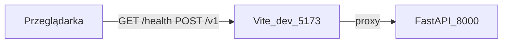

# Instalacja i uruchomienie — klient WWW

Lekki front w katalogu nadrzędnym [client/](../): **Vite 6** + **TypeScript**, bez Reacta. Woła endpointy API: `/health`, `/v1/pdf-to-text`, `/v1/to-markdown`, `/v1/docx-to-markdown`, `/v1/markdown-to-docx`, `/v1/plantuml-to-image`, `/v1/mermaid-to-image`. Nawigacja między usługami: **hash** (`#/`, `#/pdf-to-text`, itd.) — zobacz [../../docs/SERVICE_AND_CLIENT_PATTERN.md](../../docs/SERVICE_AND_CLIENT_PATTERN.md).

## Wymagania

| Składnik | Uwagi |
|----------|--------|
| **Node.js 20+** (LTS) | [nodejs.org](https://nodejs.org/) |
| **npm** | Dołączony do Node |
| **Działający backend** `utils-service` | Domyślnie `http://127.0.0.1:8000` — patrz [app/docs/install-and-run.md](../../app/docs/install-and-run.md) |

## Instalacja zależności

Z poziomu katalogu `client/` (obok `package.json`):

```powershell
cd client
npm install
```

## Tryb deweloperski (zalecany)

**Dwa procesy:** backend na porcie 8000 oraz Vite na 5173.

### 1. Backend (terminal 1, z root repozytorium)

```powershell
cd c:\Users\jbienkowsk001\Code\utils-service
.\.venv\Scripts\Activate.ps1
python -m uvicorn app.main:app --reload --host 127.0.0.1 --port 8000
```

### 2. Front (terminal 2)

```powershell
cd c:\Users\jbienkowsk001\Code\utils-service\client
npm run dev
```

Otwórz w przeglądarce adres z konsoli Vite (zwykle **http://127.0.0.1:5173**).

### Dlaczego nie trzeba CORS lokalnie

Przeglądarka woła **względne** ścieżki (`/v1/...`, `/health`) na hoście i porcie **Vite**. Serwer deweloperski **proxy** przekazuje je na backend (`vite.config.ts`). Dzięki temu origin strony i origin „API” z punktu widzenia przeglądarki to ten sam host (proxy), bez konfiguracji CORS po stronie FastAPI.



### Adres backendu (zmienna środowiskowa)

Skopiuj [../.env.example](../.env.example) do `client/.env` i ustaw np.:

```env
VITE_API_PROXY_TARGET=http://127.0.0.1:8000
```

Inny host/port — gdy API nie nasłuchuje na domyślnym `127.0.0.1:8000`.

## Uruchamianie przez PM2 (opcjonalnie)

Zamiast dwóch terminali możesz zarządzać procesami przez [PM2](https://pm2.keymetrics.io/) — backend i front uruchamiasz **osobno**. Konfiguracja: [`ecosystem.config.cjs`](../../ecosystem.config.cjs) w root repozytorium.

### Wymagania

1. PM2 globalnie: `npm install -g pm2`
2. Backend: `.venv` + `pip install -e .` (patrz [app/docs/install-and-run.md](../../app/docs/install-and-run.md))
3. Front: `npm install` w katalogu `client/` (powyżej)

### Backend (osobno)

Z root repozytorium:

```powershell
pm2 start ecosystem.config.cjs --only utils-api
# skrót: npm run pm2:api
```

API: [http://127.0.0.1:8000/docs](http://127.0.0.1:8000/docs), health: [http://127.0.0.1:8000/health](http://127.0.0.1:8000/health).

### Front — tryb dev (osobno)

```powershell
pm2 start ecosystem.config.cjs --only utils-client-dev
# skrót: npm run pm2:client:dev
```

UI: **http://127.0.0.1:5173** (proxy do API jak przy `npm run dev`).

### Front — tryb preview (osobno)

Najpierw zbuduj front:

```powershell
cd client
npm run build
cd ..
```

Potem:

```powershell
pm2 start ecosystem.config.cjs --only utils-client-preview
# skrót: npm run pm2:client:preview
```

UI: **http://127.0.0.1:4173** (proxy jak przy `npm run preview`).

### Tabela: aplikacja PM2 → URL

| Aplikacja PM2 | Port | Adres w przeglądarce |
|---------------|------|----------------------|
| `utils-api` | 8000 | API / Swagger — nie interfejs WWW |
| `utils-client-dev` | 5173 | http://127.0.0.1:5173 |
| `utils-client-preview` | 4173 | http://127.0.0.1:4173 |

Backend musi działać (`utils-api`), zanim front połączy się z `/health` i `/v1`.

### Przydatne komendy PM2

```powershell
pm2 status
pm2 logs utils-client-dev
pm2 restart utils-api
pm2 stop utils-api
pm2 delete utils-client-dev
```

Logi procesów trafiają do `logs/pm2/` (katalog ignorowany przez git).

Przy niestandardowym hoście API ustaw `VITE_API_PROXY_TARGET` w `client/.env` i zrestartuj proces frontu (`pm2 restart utils-client-dev` lub `utils-client-preview`).

## Dostęp przez reverse proxy (publiczna domena)

Gdy front (`npm run dev`, `npm run preview` lub PM2) stoi za nginx / Cloudflare i otwierasz go spod publicznej domeny (np. `https://example.allowedhosts.dev`), Vite 6 może zwrócić:

> Blocked request. This host ("example.allowedhosts.dev") is not allowed.

To zabezpieczenie Vite: nagłówek `Host` z reverse proxy musi być na liście dozwolonych hostów. Są **dwa sposoby** — wystarczy jeden.

### Sposób 1: `allowedHosts` w `vite.config.ts`

W [`client/vite.config.ts`](../vite.config.ts) dodaj domenę w sekcji `server` (tryb dev) i opcjonalnie `preview`:

```typescript
server: {
  port: 5173,
  allowedHosts: ["example.allowedhosts.dev"],
  // ...
},
preview: {
  port: 4173,
  allowedHosts: ["example.allowedhosts.dev"],
  // ...
},
```

Suffix subdomen: wpis `.allowedhosts.dev` pozwala na `example.allowedhosts.dev`, `foo.allowedhosts.dev` itd.

### Sposób 2: zmienna środowiskowa (bez edycji `vite.config.ts`)

Vite 6 umożliwia dodanie hostów przez env — wygodne na serwerze, gdy domena nie powinna trafić do repozytorium.

W `client/.env` (patrz [`.env.example`](../.env.example)):

```env
__VITE_ADDITIONAL_SERVER_ALLOWED_HOSTS=example.allowedhosts.dev
```

Wiele hostów oddziel przecinkami: `host1.example.com,host2.example.com`.

Po zmianie zrestartuj front: `pm2 restart utils-client-dev` (lub `utils-client-preview`).

### Weryfikacja

- Strona ładuje się bez „Blocked request”.
- W UI działa **`GET /health`** (proxy Vite → FastAPI na `VITE_API_PROXY_TARGET`).
- Backend (`utils-api`) musi działać równolegle; `VITE_API_PROXY_TARGET` zwykle pozostaje `http://127.0.0.1:8000`.

## Build i podgląd produkcyjny lokalnie

```powershell
cd client
npm run build
npm run preview
```

`preview` używa tego samego proxy co `dev` (patrz `vite.config.ts`).

## Hosting statyczny (`dist/`)

Po `npm run build` katalog `client/dist/` zawiera pliki statyczne. Same `file://` lub hosting bez proxy **nie** przekierują `/v1` na FastAPI — wtedy:

- **nginx (lub podobny):** ten sam host — `/` → pliki z `dist/`, ścieżki `/v1` i `/health` → upstream do FastAPI; **albo**
- **CORS** na backendzie dla domeny frontu (gdy front i API są na różnych originach).

## Funkcje interfejsu

- Przycisk / automatyczne sprawdzenie **`GET /health`**
- Formularz **PDF → tekst** (`POST /v1/pdf-to-text`, query `ocr`), **plik → Markdown** (`POST /v1/to-markdown`) oraz **DOCX → Markdown** (`POST /v1/docx-to-markdown`, query `comments`, `extract_media`)
- **Wybór pliku:** standardowy przycisk systemowy oraz **strefa przeciągnij-i-upuść** (PDF tylko pliki `.pdf` / typ `application/pdf`)
- **Kopiuj:** zapis treści pola wyniku do schowka (`navigator.clipboard`) — wymaga zwykle **HTTPS** lub **`localhost`**; przy braku uprawnień pojawi się podpowiedź (można skopiować ręcznie z pola)
- **Zwiń / pokaż odpowiedź:** zwijanie bloku z polem tekstowym wyniku (treść pozostaje w polu; „Kopiuj” nadal kopiuje aktualną zawartość)

## Typowe problemy

| Objaw | Co sprawdzić |
|--------|----------------|
| „API nieosiągalne” / błąd `/health` | Czy uvicorn działa na `VITE_API_PROXY_TARGET`; czy `.env` w `client/` jest poprawny (wymaga restartu `npm run dev`). |
| 502 / „connection refused” w konsoli sieci | Backend wyłączony lub zły port w `VITE_API_PROXY_TARGET`. |
| Po `build` brak działania na zwykłym hostingu plików | Brak reverse proxy lub CORS — patrz sekcja „Hosting statyczny”. |
| Schowek / „Kopiuj” nie działa | Czy strona jest na `localhost` lub HTTPS; w niektórych przeglądarkach trzeba zezwolić na dostęp do schowka. |
| „Blocked request. This host … is not allowed” | Domena spoza `localhost` — patrz sekcja [Dostęp przez reverse proxy](#dostęp-przez-reverse-proxy-publiczna-domena): `allowedHosts` w `vite.config.ts` **lub** `__VITE_ADDITIONAL_SERVER_ALLOWED_HOSTS` w `client/.env`. |
